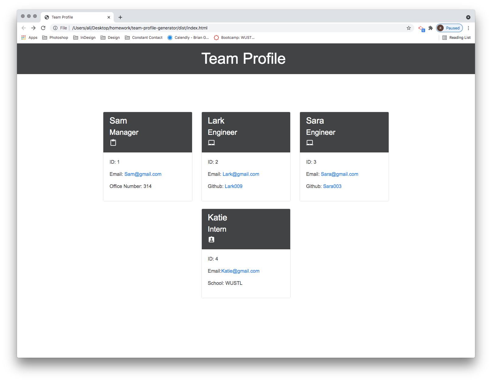

# team-profile-generator

Template Engine - Employee Summary

The Challenge -  Build a Node CLI that takes in information about employees and generates an HTML webpage that displays summaries for each person. Since testing is a key piece in making code maintainable all unit tests must pass.

Description
This application was created to generate a team profile based on user input using the Inquirer module from Node.js and displaying the information on a newly created html page that includes a style sheet. This project shows the use of Object-oriented programming (OOP) and Test Driven Development (TDD) using Jest.

ScreenShot - 
The following screenshot shows the generated HTML Homescreen:

Installation
The user should clone the repository from GitHub and download Node. This application also requires a file system and inquirer module. If testing is required, this application uses Jest.

License
This project is license under MIT